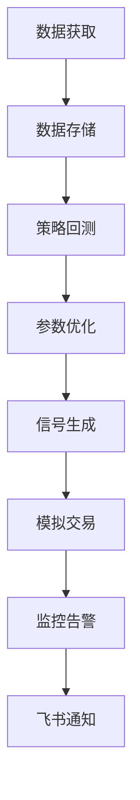

# 📈 A股ETF量化交易系统

[](https://www.python.org/)
[](LICENSE)
[](https://github.com/yourusername/a-share-etf-quant/actions)
[](https://github.com/psf/black)

一个全功能的A股ETF量化交易系统，支持数据获取、策略回测、参数优化、模拟交易的全流程自动化。

## 🎯 核心特性

- ✅ **20+ 交易策略**：MA、MACD、RSI、布林带、KDJ、ATR、OBV、海龟等
- ⚡ **高性能回测**：多进程并行，80+ ETF × 20策略 < 5分钟
- 🛡️ **完整风控**：移动止损、分档止盈、动态仓位
- 💰 **精确成本模型**：佣金(0.03%) + 印花税(0.05%) + 滑点(0.05%)
- 🔄 **自动化数据管道**：每日增量更新ETF数据
- 📡 **模拟盘集成**：Claw Street API对接，支持实时模拟交易
- 📊 **实时监控看板**：Flask Web界面，Chart.js可视化
- 🚨 **智能告警**：飞书Webhook通知，异常实时提醒

## 📋 快速开始

### 环境准备

```bash
# 1. 克隆仓库
git clone https://github.com/yourusername/a-share-etf-quant.git
cd a-share-etf-quant

# 2. 安装依赖
pip install -r requirements.txt

# 3. 下载ETF数据（或使用模拟数据）
python3 scripts/fetch_etf_universe.py --full

# 4. 启动模拟交易看板
python3 dashboard/sim_trader.py
```

访问看板：http://localhost:8082

### 快速命令

| 操作 | 命令 |
|------|------|
| 下载数据 | `python3 scripts/fetch_etf_universe.py` |
| 单ETF回测 | `python3 scripts/explore_strategies.py --ticker 510300` |
| 批量回测 | `python3 scripts/explore_strategies.py --parallel` |
| 参数优化 | `python3 scripts/parameter_sweep.py` |
| 生成信号 | `python3 scripts/generate_signals.py` |
| 安全审计 | `python3 scripts/security_audit.py` |

## 🏗️ 系统架构



详细架构说明：查看 [`docs/architecture.md`](docs/architecture.md)

## 📊 策略库

| 策略 | 类型 | 说明 |
|------|------|------|
| `ma_cross` | 趋势跟踪 | 均线金叉死叉 |
| `macd_cross` | 动量 | MACD交叉 |
| `rsi_extreme` | 均值回归 | RSI超买超卖 |
| `bollinger_band` | 波动率 | 布林带突破 |
| `ta_confluence` | 多因子 | 多策略共振 |
| `kdj_cross` | 震荡指标 | KDJ金叉死叉 |
| `atr_channel` | 突破 | ATR通道 |
| `obv` | 量价 | OBV背离 |
| `adx` | 趋势强度 | ADX过滤 |
| `turtle` | 趋势跟踪 | 海龟系统 |
| ... | ... | ... 共20+种 |

完整策略列表：查看 [`docs/strategy_guide.md`](docs/strategy_guide.md)

## 🔧 配置说明

### 环境变量

```bash
# Required (for live trading)
export CLAW_STREET_API_KEY="your_api_key_here"

# Optional
export CLAW_STREET_URL="https://api.clawstreet.com/v1"
export FEISHU_WEBHOOK_URL="https://open.feishu.cn/..."
```

### GitHub Actions CI

配置自动测试：

1. Fork 本仓库
2. 在 GitHub 仓库 Settings → Secrets 添加：
   - `CLAW_STREET_URL` (可选)
   - `FEISHU_WEBHOOK_URL` (可选)
3. Push 代码自动触发 CI

CI 流程包括：
- ✅ 安全审计（阻塞高风险问题）
- ✅ 语法检查 + 模块导入测试
- ✅ 回测烟雾测试
- ✅ 文档完整性检查
- ✅ 性能基准测试（仅 main 分支）

## 📁 项目结构

```
a-share-etf-quant/
├── scripts/           # 核心脚本(回测、数据、分析...)
├── virtual_account.py # 虚拟账户管理
├── clients/           # API客户端
├── dashboard/         # Web监控看板
├── docs/              # 完整文档
├── data/              # 数据目录（gitignore）
├── results/           # 回测结果（gitignore）
├── signals/           # 交易信号（gitignore）
├── accounts/          # 账户状态（gitignore）
└── requirements.txt   # Python依赖
```

完整文件结构：查看 [`docs/architecture.md`](docs/architecture.md)

## 🧪 测试

```bash
# 运行所有单元测试（如果有）
pytest tests/

# 快速烟雾测试
python3 scripts/explore_strategies.py --ticker 510300 --from-date 2024-01-01

# 安全审计
python3 scripts/security_audit.py

# 性能基准
python3 scripts/benchmark.py
```

## 📚 文档

完整文档位于 `docs/` 目录：

- [📖 README](docs/README.md) - 项目概述、特性、快速开始
- [🏗️ Architecture](docs/architecture.md) - 系统架构、模块职责
- [🚀 Deployment](docs/deployment.md) - 部署配置、CI/CD、Docker
- [📊 Strategy Guide](docs/strategy_guide.md) - 策略开发、测试方法

**在线文档**: 也可查看 [飞书完整文档](https://feishu.cn/docx/Vc8BdZHE2oqzMZxDxlEc19gunZd)（最新版）

## 🤝 贡献

欢迎提交 PR 或 Issue！

开发流程：
1. Fork 仓库
2. 创建特性分支 (`git checkout -b feature/AmazingFeature`)
3. 提交更改 (`git commit -m 'Add AmazingFeature'`)
4. 推送到分支 (`git push origin feature/AmazingFeature`)
5. 打开 Pull Request

请确保：
- ✅ 代码通过 CI 检查
- ✅ 添加相应测试
- ✅ 更新文档
- ✅ 遵循 Conventional Commits 规范

## 📄 License

MIT License. 详见 [LICENSE](LICENSE) 文件。

## 🙋‍♂️ 支持

- 📧 项目Issues: [GitHub Issues](https://github.com/yourusername/a-share-etf-quant/issues)
- 📚 文档: [`docs/`](docs/) 目录
- 💬 讨论: [Discord](https://discord.com/invite/clawd) 或飞书群

---

**最后更新**: 2026-03-06  
**维护者**: 小灵 (OpenClaw Agent)
