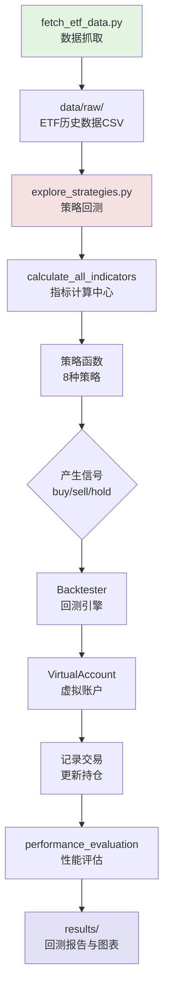

# A股ETF量化回测与轮动系统

> 📊 基于10年历史数据的A股ETF量化策略研究平台 | 支持20+种技术指标策略 | 一键回测与自动化更新

---

## 🎯 项目概述

**A股ETF量化回测与轮动系统**是一个专业的量化策略研究平台，专注于中国A股市场ETF产品的历史数据分析、策略回测与性能评估。

### 核心目标
- 基于 **2015-2025年10年历史数据**，探索天级别交易策略的有效性
- 覆盖全体A股ETF（当前约80只，历史数据更完整）
- 验证技术指标策略（MA、MACD、RSI、布林带等）在A股ETF上的表现
- 提供可复用的策略框架，支持快速开发、测试和优化新策略

### 适用人群
- 量化策略研究者
- 个人投资者探索ETF轮动策略
- 希望理解技术指标在A股市场表现的研究者

---

## ✨ 核心特性

### 1. 📈 丰富的数据支持
- ✅ **全量ETF覆盖**：自动获取所有A股ETF列表及历史数据
- ✅ **10年历史回测**：2015年至2025年的完整日线数据
- ✅ **多维度指标**：内置20+种技术指标（MA、RSI、MACD、布林带、ATR、KDJ、OBV、ADX等）
- ✅ **智能数据更新**：增量更新，避免重复下载
- ✅ **数据质量验证**：自动验证数据完整性、连续性

### 2. 🔬 多样化的策略库
内置 **8种经典策略**，开箱即用：

| 策略名称 | 策略类型 | 核心逻辑 |
|---------|---------|---------|
| `kdj_cross` | 震荡指标 | KDJ金叉死叉 |
| `atr_channel` | 通道突破 | ATR通道上下轨突破 |
| `obv` | 量价背离 | OBV能量潮背离检测 |
| `adx` | 趋势强度 | ADX过滤强趋势方向 |
| `turtle` | 趋势跟踪 | 海龟交易法则（突破20日高点） |
| `double_top_bottom` | 形态识别 | 双顶双底形态 |
| `pair_trading` | 统计套利 | 价差回归策略 |
| `simple_ml` | 机器学习 | 多因子组合预测 |

### 3. ⚙️ 灵活的回测框架
- **模块化设计**：策略与回测引擎解耦，易于扩展
- **虚拟账户管理**：支持仓位控制、止损止盈、交易记录
- **性能评估**：自动计算总收益率、年化收益率、最大回撤、夏普比率、胜率、盈亏比
- **参数优化**：支持网格搜索优化策略参数

### 4. 🚀 生产级部署
- **GitHub Actions 自动化**：每日16:00自动更新最新数据
- **飞书告警**：更新失败时自动发送通知（需配置 webhook）
- **完整日志**：详细的操作日志和错误追踪
- **数据验证**：自动检测数据质量问题并记录

---

## 🚀 快速开始

### 前置要求
- Python 3.10+
- pip 包管理器
- 网络连接（用于下载数据）

### 5步安装与运行

#### 步骤 1：克隆项目
```bash
cd ~/.openclaw/workspace/projects/a-share-etf-quant
```

#### 步骤 2：安装依赖
```bash
pip install -r requirements.txt
```
依赖包包括：
- `akshare` - 中国金融数据接口
- `pandas` - 数据处理
- `numpy` - 数值计算
- `tqdm` - 进度条
- `requests` - 网络请求（飞书通知）

#### 步骤 3：首次全量数据抓取（约1-2小时）
```bash
python scripts/fetch_etf_data.py
```
数据将保存到 `data/raw/etf_history_YYYY_YYYY.csv`

#### 步骤 4：运行策略回测
```bash
python scripts/explore_strategies.py
```
自动执行：
- 加载历史数据
- 计算技术指标
- 运行所有策略回测
- 生成性能报告和图表

#### 步骤 5：查看结果
```bash
# 查看回测报告
ls results/

# 查看资金曲线
open results/equity_curve_*.png

# 查看性能对比表
open results/performance_summary.csv
```

---

## 📦 项目结构

```
a-share-etf-quant/
├── scripts/                     # 核心脚本目录
│   ├── backtester.py           # 回测引擎
│   ├── daily_update.py         # 每日数据更新（生产环境使用）
│   ├── explore_strategies.py   # 策略探索与回测
│   ├── fetch_etf_data.py       # ETF数据抓取（首次使用）
│   ├── fetch_etf_universe.py   # ETF列表获取
│   ├── generate_signals.py     # 信号生成器
│   ├── parameter_sweep.py      # 参数优化
│   ├── strategies.py           # 策略库（8种策略实现）
│   ├── virtual_account.py      # 虚拟账户管理类
│   └── strategies/             # 额外策略目录
│       └── etf_rotation.py     # ETF轮动策略
├── clients/                     # API客户端
│   └── claw_street_client.py   # Claw Street交易平台客户端
├── data/                        # 数据存储
│   ├── raw/                    # 原始数据（CSV）
│   ├── processed/              # 处理后的数据
│   └── accounts/               # 虚拟账户状态
├── logs/                        # 日志文件
│   ├── daily_update_*.log      # 每日更新日志
│   ├── data_validation_*.log   # 数据验证报告
│   └── claw_street_client.log  # API客户端日志
├── results/                     # 回测结果
│   ├── equity_curve_*.png      # 资金曲线图
│   ├── performance_summary.csv # 性能对比表
│   └── detailed_report_*.md    # 详细回测报告
├── virtual_account.py          # 虚拟账户（根目录副本）
├── requirements.txt            # Python依赖
├── run_all.sh                  # 一键启动脚本
├── README.md                   # 本文档
├── RUN_INSTRUCTIONS.md         # 运行说明
├── UPDATE_GUIDE.md             # 更新指南
├── ADDED_FILES.md              # 新增文件说明
└── .github/
    └── workflows/
        └── daily_update.yml   # GitHub Actions自动化配置
```

---

## 🏗️ 架构总览

系统的核心架构可以分为 **五个层次**：

```
┌─────────────────────────────────────────────────────────────┐
│                     用户接口层                               │
│  命令行脚本（explore_strategies.py） + GitHub Actions      │
└─────────────────────────────┬───────────────────────────────┘
                              │
┌─────────────────────────────▼───────────────────────────────┐
│                    策略执行层                                │
│  strategy_selector → calculate_all_indicators → Backtester │
└─────────────────────────────┬───────────────────────────────┘
                              │
┌─────────────────────────────▼───────────────────────────────┐
│                    策略库层                                 │
│  8种内置策略（KDJ、ATR、OBV、ADX、Turtle等）                │
└─────────────────────────────┬───────────────────────────────┘
                              │
┌─────────────────────────────▼───────────────────────────────┐
│                    账户管理层                              │
│  VirtualAccount（现金、持仓、交易记录、持久化）            │
└─────────────────────────────┬───────────────────────────────┘
                              │
┌─────────────────────────────▼───────────────────────────────┐
│                    数据层                                   │
│  CSV文件 → DataFrame → 技术指标计算 → 回测数据              │
└─────────────────────────────────────────────────────────────┘
```

### 核心流程图（数据流）



### 关键组件说明

#### 1. 数据抓取模块 (`scripts/fetch_etf_data.py`)
- 使用 `akshare` 获取A股ETF实时列表
- 下载每只ETF的10年日线数据（前复权）
- 支持断点续传和增量更新
- 数据存储为CSV格式，便于后续处理

#### 2. 指标计算中心 (`scripts/strategies.py:calculate_all_indicators`)
- **统一计算**：一次性计算所有策略所需的技术指标
- **性能优化**：避免重复计算，显著提升回测速度
- **支持指标**：MA、RSI、ATR、布林带、KDJ、OBV、ADX、成交量比等

#### 3. 策略库 (`scripts/strategies.py`)
- **策略签名**：`def strategy_name(row: pd.Series) -> str`
- **输入**：包含OHLCV数据和技术指标的pandas Series
- **输出**：`'buy'`、`'sell'` 或 `'hold'`
- **注册机制**：通过 `STRATEGIES` 字典统一管理

#### 4. 回测引擎 (`scripts/backtester.py`)
- 逐日遍历数据，调用策略生成信号
- 委托 `VirtualAccount` 执行交易
- 记录每笔交易、每日资产变化
- 计算性能指标（收益率、回撤、夏普比率等）

#### 5. 虚拟账户 (`virtual_account.py`)
- 管理现金、持仓、交易历史
- 支持仓位控制（单只ETF ≤ 10%）
- 自动计算市值、浮动盈亏
- 状态持久化（JSON格式）
- 线程安全（RLock）

---

## 🎯 常见使用场景

### 场景 1：快速测试策略效果
```bash
# 1. 确保数据已下载
python scripts/fetch_etf_data.py

# 2. 运行探索性回测（会测试所有策略）
python scripts/explore_strategies.py

# 3. 查看结果目录
ls results/
```

### 场景 2：优化单一策略参数
```bash
python scripts/parameter_sweep.py --strategy kdj_cross
```
参数扫描会测试不同参数组合，输出性能最佳的参数配置。

### 场景 3：开发自己的策略
1. 在 `scripts/strategies.py` 中添加新函数
2. 遵循 `def my_strategy(row) -> str` 签名
3. 注册到 `STRATEGIES` 字典
4. 运行 `explore_strategies.py` 测试

详细开发指南见 [策略开发指南](strategy_guide.md)

### 场景 4：每日自动化更新
```bash
# 手动触发每日更新（生产环境）
python scripts/daily_update.py
```
或配置 GitHub Actions 自动执行（见 [deployment.md](deployment.md)）

---

## 📖 更多文档

- **[架构详解](architecture.md)** - 系统架构图、模块职责、配置文件说明
- **[策略开发指南](strategy_guide.md)** - 如何开发新策略、测试方法、性能评估
- **[生产部署](deployment.md)** - 环境变量配置、crontab设置、GitHub Actions、监控告警

---

## 🤝 贡献

欢迎提交 Issue 和 Pull Request！

**开发规范**：
- 遵循 PEP 8 代码风格
- 添加类型提示
- 更新文档和注释
- 确保脚本可测试（分离逻辑）

---

**开始你的量化之旅** 📈

```bash
# 一键启动（自动安装依赖 + 下载数据 + 回测）
./run_all.sh

# 或者分步执行
python scripts/fetch_etf_data.py
python scripts/explore_strategies.py
```

祝量化研究顺利！有任何问题请查看 [故障排除指南](RUN_INSTRUCTIONS.md)
