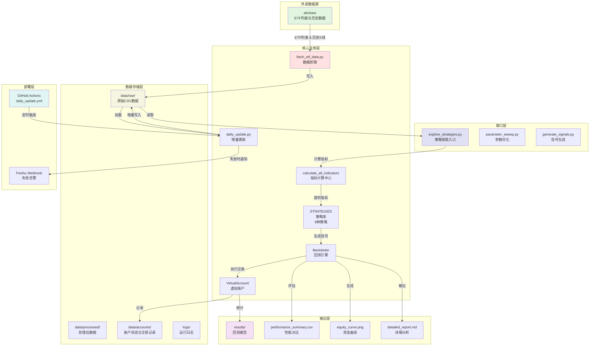

# 系统架构详解

本文档详细说明 **A股ETF量化回测与轮动系统** 的整体架构、数据流程、模块职责和配置说明。

---

## 🏛️ 系统架构图



---

## 🔄 数据流详解

### 完整数据流程（5个阶段）

```
┌─────────────┐
│  数据抓取   │  fetch_etf_data.py / fetch_etf_universe.py
│  (Fetch)    │  └─ 使用 akshare 获取ETF列表和日线数据
└──────┬──────┘       ↓
       │          ┌─────────────────────┐
       │          │ data/raw/           │
       └─────────>│ etf_history_*.csv   │
                  │ （约10万条记录）     │
                  └──────────┬──────────┘
                            ↓
┌─────────────┐      ┌─────────────────────┐
│ 策略回测     │      │ 数据加载与预处理    │
│  (Backtest) │ <─── │ explore_strategies  │
│             │      │ - 读取CSV          │
│ - 逐日计算   │      │ - 时间筛选         │
│ - 生成信号   │      │ - 缺失值处理       │
│ - 执行交易   │      └──────────┬──────────┘
└──────┬──────┘                  ↓
       │                 ┌─────────────────────┐
       │                 │ calculate_all_      │
       │                 │ indicators          │
       │                 │ - 计算MA/RSI/ATR   │
       │                 │ - 计算布林带/KDJ   │
       │                 │ - 计算OBV/ADX等    │
       │                 └──────────┬──────────┘
       │                            ↓
       │                 ┌─────────────────────┐
       │                 │ 策略函数            │
       │                 │ strategy_xxx()      │
       │                 │ - 接收单行数据      │
       │                 │ - 返回buy/sell/hold│
       │                 └──────────┬──────────┘
       │                            ↓
       └─────────────────────────>│
                    ┌─────────────────────┐
                    │ Backtester          │
                    │ - 信号管理          │
                    │ - 交易执行          │
                    │ - 绩效计算          │
                    └──────────┬──────────┘
                               ↓
                  ┌─────────────────────┐
                  │ VirtualAccount      │
                  │ - 现金/持仓管理     │
                  │ - 交易记录          │
                  │ - 状态持久化        │
                  └──────────┬──────────┘
                             ↓
                  ┌─────────────────────┐
                  │ results/            │
                  │ - 资金曲线.png      │
                  │ - 性能对比.csv      │
                  │ - 详细报告.md       │
                  └─────────────────────┘
```

### 关键数据转换点

1. **CSV → DataFrame** (`pandas.read_csv()`)
   - 列名规范化：date, open, high, low, close, volume
   - 日期索引转换

2. **DataFrame → 指标增强** (`calculate_all_indicators()`)
   - 添加30+个技术指标列
   - 单次遍历完成所有计算（性能优化）

3. **DataFrame的行 → 策略信号** (`strategy_func(row)`)
   - 按日期逐行处理
   - 策略函数接收pandas Series
   - 返回交易信号字符串

4. **信号 → 交易执行** (`Backtester.execute()`)
   - 检查持仓和现金是否充足
   - 调用 `VirtualAccount.execute_trade()`
   - 记录交易细节（时间、价格、数量、类型）

5. **交易记录 → 绩效统计** (`Backtester.evaluate()`)
   - 计算每日资产总值
   - 计算收益率序列
   - 计算最大回撤、夏普比率、胜率、盈亏比

---

## 📦 模块职责表

### scripts/ 目录模块

| 模块 | 职责 | 输入 | 输出 | 关键类/函数 |
|------|------|------|------|-----------|
| **backtester.py** | 回测引擎核心 | DataFrame + 策略函数 | 交易记录、绩效数据 | `Backtester`, `BacktestResult` |
| **daily_update.py** | 生产环境每日更新 | 环境（网络、已有数据） | 最新数据文件、日志 | `daily_update_main()` |
| **explore_strategies.py** | 策略探索入口 | 数据文件路径 | 回测结果、图表、报告 | `main()`, `run_all_strategies()` |
| **fetch_etf_data.py** | ETF数据下载（首次） | - | CSV数据文件 | `fetch_all_etf_data()` |
| **fetch_etf_universe.py** | 获取ETF列表 | - | ETF元数据DataFrame | `get_etf_universe()` |
| **generate_signals.py** | 批量信号生成 | 数据文件 + 策略名 | 信号CSV | `generate_signals()` |
| **parameter_sweep.py** | 参数网格搜索 | 策略名 + 参数范围 | 最优参数、性能表 | `sweep_parameters()` |
| **strategies.py** | 策略库（8种策略） | 指标行（Series） | 信号字符串 | `strategy_kdj_cross()`, `calculate_all_indicators()`, `STRATEGIES` |
| **strategies/etf_rotation.py** | ETF轮动策略 | 多只ETF数据 | 买卖信号 | `etf_rotation_strategy()` |
| **virtual_account.py** | 虚拟账户管理 | 交易指令 | 持仓、余额、历史 | `VirtualAccount` 类 |

### clients/ 目录模块

| 模块 | 职责 | 主要API |
|------|------|---------|
| **claw_street_client.py** | Claw Street交易平台客户端 | 账户查询、下单、撤单、持仓管理 |

---

## ⚙️ 配置文件与环境变量

### 必需环境变量

| 变量名 | 用途 | 示例值 | 配置位置 |
|--------|------|--------|---------|
| `CLAW_STREET_URL` | Claw Street API基础URL | `https://api.clawstreet.com/v1` | `.env` 或 shell export |
| `FEISHU_WEBHOOK_URL` | 飞书机器人webhook（失败告警） | `https://open.feishu.cn/...` | GitHub Secrets 或本地环境 |

### 可选环境变量

| 变量名 | 用途 | 默认值 |
|--------|------|--------|
| `AKSHARE_PROXY` | akshare代理服务器（如网络受限） | 无 |
| `PYTHONUNBUFFERED` | Python输出缓冲 | `1`（建议设置） |
| `LOG_LEVEL` | 日志级别（DEBUG/INFO/WARNING/ERROR） | `INFO` |

### 配置文件位置

```bash
# 1. 本地环境变量（开发）
export CLAW_STREET_URL="https://api.clawstreet.com/v1"
export FEISHU_WEBHOOK_URL="https://open.feishu.cn/open-apis/bot/v2/hook/..."

# 2. GitHub Actions Secrets（生产自动化）
# 在仓库 Settings -> Secrets and variables -> Actions 中添加
# - FEISHU_WEBHOOK_URL
# - CLAW_STREET_API_KEY（如有需要）

# 3. .env 文件（建议，可使用 python-dotenv）
CLAW_STREET_URL=https://api.clawstreet.com/v1
FEISHU_WEBHOOK_URL=https://open.feishu.cn/open-apis/bot/v2/hook/xxxxx
```

### 配置文件模板

```bash
# .env 文件模板（复制为 .env 并填写实际值）
cat > .env << 'EOF'
# Claw Street API配置
CLAW_STREET_URL=https://api.clawstreet.com/v1
export CLAW_STREET_URL

# 飞书通知webhook（可选）
FEISHU_WEBHOOK_URL=https://open.feishu.cn/open-apis/bot/v2/hook/your-webhook-token
export FEISHU_WEBHOOK_URL

# akshare代理（如需要）
# AKSHARE_PROXY=http://127.0.0.1:7890
# export AKSHARE_PROXY

# 日志级别
LOG_LEVEL=INFO
export LOG_LEVEL
EOF
```

---

## 🔧 关键类与函数接口

### VirtualAccount（虚拟账户）

```python
from virtual_account import VirtualAccount

# 初始化
account = VirtualAccount(initial_capital=1000000.0, data_dir="data")

# 查询
cash = account.get_balance()           # 可用现金
positions = account.get_positions()    # 持仓详情
total = account.get_total_value()      # 总资产

# 交易
account.execute_trade(
    symbol="510300",
    quantity=100,
    price=4.50,
    order_type="buy"  # 或 "sell"
)

# 状态持久化
account.save_state("2024-03-06")

# 查看交易历史
trades = account.get_trade_history()
```

### Backtester（回测引擎）

```python
from backtester import Backtester
from strategies import calculate_all_indicators, get_strategy

# 加载数据
df = pd.read_csv("data/raw/etf_history_2015_2025.csv")
df = calculate_all_indicators(df)

# 初始化回测器
backtester = Backtester(
    data=df,
    initial_capital=100000,
    strategy=get_strategy("kdj_cross"),
    position_limit=0.1,  # 单只ETF最大仓位10%
    stop_loss=0.03,     # 止损3%
    take_profit=0.08    # 止盈8%
)

# 执行回测
result = backtester.run()

# 查看结果
print(f"总收益率: {result.total_return:.2%}")
print(f"最大回撤: {result.max_drawdown:.2%}")
print(f"夏普比率: {result.sharpe_ratio:.2f}")
print(f"胜率: {result.win_rate:.2%}")

# 导出
result.export_to_csv("results/performance.csv")
result.plot_equity_curve("results/equity_curve.png")
```

### 策略函数签名

所有策略函数必须遵循以下签名：

```python
def strategy_name(row: pd.Series, context: Dict = None) -> str:
    """
    策略逻辑描述

    参数:
        row: 包含OHLCV和技术指标的DataFrame单行
        context: 上下文字典（可选，用于需要历史状态的策略）

    返回:
        'buy' | 'sell' | 'hold'
    """
    # 1. 提取指标（使用 .get() 避免KeyError）
    close = row.get('close', np.nan)
    ma20 = row.get('ma20', np.nan)
    atr = row.get('atr_14', np.nan)

    # 2. 检查NaN
    if pd.isna(close) or pd.isna(ma20):
        return 'hold'

    # 3. 策略逻辑
    if close > ma20:
        return 'buy'
    elif close < ma20 * 0.98:
        return 'sell'
    else:
        return 'hold'
```

---

## 📊 性能评估指标

回测完成后，系统自动计算以下指标：

| 指标 | 公式 | 说明 |
|------|------|------|
| **总收益率** | `(final_value - initial) / initial` | 整个回测周期的绝对收益 |
| **年化收益率** | `(1 + total_return) ** (252 / N) - 1` | 按252个交易日年化 |
| **最大回撤** | `max(peak - trough) / peak` | 最大峰值到谷值的跌幅 |
| **夏普比率** | `(mean_daily_return - risk_free) / std_daily_return * √252` | 风险调整后收益 |
| **胜率** | `win_trades / total_trades` | 盈利交易占比 |
| **盈亏比** | `avg_win / avg_loss` | 平均盈利/平均亏损 |
| **换手率** | `总交易股数 / 平均持仓股数` | 交易活跃度 |
| **Calmar比率** | `annual_return / max_drawdown` | 回撤调整收益 |

### 输出文件说明

```
results/
├── performance_summary.csv      # 所有策略性能对比表
├── equity_curve_<strategy>.png  # 资金曲线图（每策略一张）
├── trades_<strategy>.csv        # 详细交易记录
├── detailed_report_<strategy>.md # 详细回测报告（Markdown）
├── signals_<strategy>.csv       # 每日信号记录
└── summary.json                 # 汇总数据（JSON）
```

---

## 🔍 扩展与定制

### 添加新策略的步骤

1. **在 `scripts/strategies.py` 中实现策略函数**
   ```python
   def strategy_my_new_strategy(row: pd.Series) -> str:
       # 使用已计算好的指标
       ma_short = row.get('ma5', np.nan)
       ma_long = row.get('ma20', np.nan)

       if pd.isna(ma_short) or pd.isna(ma_long):
           return 'hold'

       if ma_short > ma_long:
           return 'buy'
       elif ma_short < ma_long * 0.98:
           return 'sell'
       else:
           return 'hold'
   ```

2. **注册到策略字典**
   ```python
   STRATEGIES = {
       'kdj_cross': strategy_kdj_cross,
       # ... 其他策略
       'my_new_strategy': strategy_my_new_strategy,  # 添加这一行
   }
   ```

3. **（可选）在 `calculate_all_indicators()` 中计算所需指标**
   如果策略需要新的技术指标，添加计算逻辑。

4. **测试策略**
   ```bash
   python scripts/explore_strategies.py --strategy my_new_strategy
   ```

5. **更新文档**
   在 `docs/strategy_guide.md` 的策略列表中添加你的策略。

---

## 🛡️ 错误处理与日志

### 日志文件位置

```
logs/
├── daily_update_YYYY-MM-DD.log        # 每日更新详细日志
├── data_validation_YYYY-MM-DD.log     # 数据验证报告
├── claw_street_client.log             # API客户端日志
└── errors.log                         # 全局错误汇总
```

### 日志级别

- `DEBUG` - 详细调试信息（仅开发时使用）
- `INFO` - 一般信息（默认）
- `WARNING` - 警告但不影响运行
- `ERROR` - 错误导致部分功能失败

### 常见错误及处理

| 错误现象 | 可能原因 | 解决方案 |
|---------|---------|---------|
| `akshare` 请求失败 | 网络问题或API限制 | 检查网络，使用代理，或稍后重试 |
| 数据文件缺失 | 未运行首次数据抓取 | 执行 `python scripts/fetch_etf_data.py` |
| 指标全为NaN | 数据长度不足（如MA20需20个点） | 等待足够数据，或调整指标周期 |
| 回测无交易信号 | 策略条件过于严格 | 调整策略参数，检查信号逻辑 |
| 内存不足 | 数据量过大 | 使用增量加载，或分段处理 |

---

## 📈 数据存储规范

### CSV数据格式

```csv
date,open,high,low,close,volume
2024-01-02,3.50,3.52,3.48,3.51,1234567
2024-01-03,3.51,3.55,3.50,3.54,2345678
...
```

### 文件命名规则

- 原始数据：`etf_history_2015_2025.csv`
- 处理数据：`etf_processed_20240306.csv`
- 信号文件：`signals_kdj_cross_20240306.csv`
- 日志文件：`daily_update_2024-03-06.log`
- 账户状态：`accounts/states/state_2024-03-06.json`

### 数据目录结构

```
data/
├── raw/
│   ├── etf_history_2015_2025.csv    # 主历史数据
│   ├── etf_list_20240306.csv       # ETF列表快照
│   └── latest_date.txt             # 最新数据日期标记
├── processed/
│   ├── indicators_*.pickle         # 预计算指标缓存
│   └── signals_*.csv               # 生成的信号
├── accounts/
│   ├── states/                     # 账户状态快照
│   ├── trades.json                 # 交易历史
│   └── portfolio.json              # 持仓快照
└── cache/                          # 临时缓存（gitignore）
```

---

## 🎓 最佳实践

1. **数据抓取**
   - 首次运行使用 `fetch_etf_data.py` 全量下载
   - 后续每日使用 `daily_update.py` 增量更新
   - 配置 GitHub Actions 实现自动化

2. **策略开发**
   - 所有策略统一使用 `strategies.py` 中的 `calculate_all_indicators()`
   - 使用 `.get()` 访问Series字段，避免KeyError
   - 始终检查NaN值（`.isna()` 或 `pd.isna()`）
   - 策略函数保持纯函数性质（无副作用）

3. **回测验证**
   - 使用 **训练集（2015-2021）** 优化参数
   - 使用 **测试集（2022-2025）** 验证效果
   - 避免未来函数（forward-looking bias）
   - 考虑交易成本（佣金、滑点）

4. **性能优化**
   - 大参数扫描使用 `parameter_sweep.py` 的 `--parallel` 选项
   - 指标预计算避免重复计算
   - 使用 `pandas` 向量化操作而非循环

---

## 📚 相关文档

- **[README.md](README.md)** - 项目快速指南
- **[strategy_guide.md](strategy_guide.md)** - 策略开发详解
- **[deployment.md](deployment.md)** - 生产部署与监控

---

**架构设计原则**：模块化、可复用、易扩展、生产就绪 💡
